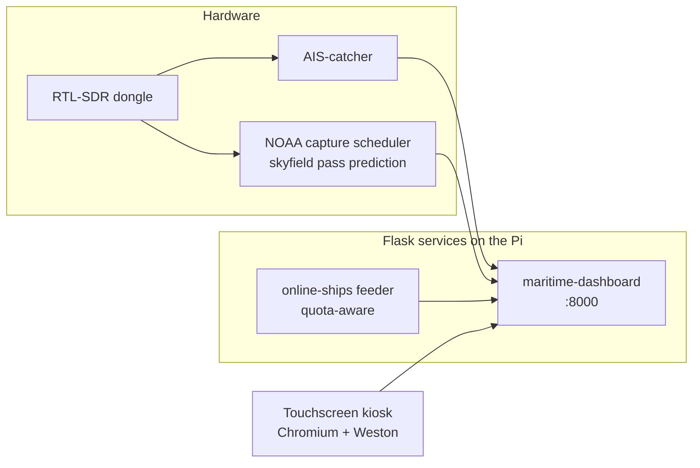
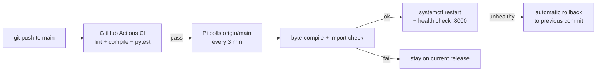

# Maritime Dashboard


A self-hosted marine situation display for the south coast of Ireland,
running 24/7 on a Raspberry Pi with a touchscreen kiosk. It combines this
station's own AIS receiver (RTL-SDR + [AIS-catcher](https://github.com/jvde-github/AIS-catcher))
with live NOAA weather-satellite passes and an online ship feed.

## What it shows

- **AIS tab** — ships decoded from the station's own antenna, with live
  RF signal power at the AIS band
- **NOAA tab** — images decoded from NOAA 15/18/19 weather satellite passes,
  captured automatically as the satellites go overhead
- **Online tab** — vessels from the [VesselAPI](https://api.vesselapi.com)
  REST feed (orange markers), clearly separated from own-antenna data
- System health strip: CPU temperature, memory, disk, uptime, SDR detection

## How it runs



Four systemd units cooperate (all defined outside this repo on the host):

| Unit | Role |
|------|------|
| `maritime-dashboard` | This Flask app, port 8000 |
| `noaa-scheduler` | `scripts/noaa_scheduler.py` — predicts passes with skyfield, records audio, decodes images |
| `online-ships` | `scripts/online_ships.py` — quota-aware VesselAPI feed, writes `online_ships.json` |
| `sdr-monitor` | Signal-power sampling for the AIS band meter |

The API degrades honestly: with no SDR, no systemd or no state files
present, every endpoint still answers with sane defaults — which is what
the test suite in `tests/` locks in.

## Online-ships quota design

The free VesselAPI tier has a small monthly quota, so the feeder is
quota-aware rather than naive:

- background refresh at most every 20 minutes
- extra fetches only when someone is actually viewing the Online tab,
  hard-capped at one per 10 minutes no matter how many browsers ask
- on quota errors it backs off for 6 hours instead of burning requests

To use your own key: `echo "YOUR_KEY" > vesselapi_key.txt` (this file is
gitignored and read at runtime — no secrets live in the repo).

## CI/CD

CI runs on every push and pull request (GitHub Actions, Python 3.11 and
3.13): ruff fatal-rule lint, byte-compilation, and the pytest suite.

Deployment is **pull-based**: the Pi polls `origin/main` every 3 minutes
(`deploy/deploy.sh` + systemd timer). A new commit is byte-compiled and
import-checked *before* the service restarts; if the app then fails its
health check, the previous commit is automatically redeployed. Commits
made directly on the Pi restart the service through the same gate —
the deploy marker (`.deployed_commit`) tracks what is actually running.
Unpushed local work is never overwritten, and a commit that failed its
health check is never retried until a newer commit lands.



Only `origin/main` is ever deployed, so pull requests from forks can
never execute code on the host.

## Local development

```bash
python3 -m venv venv
venv/bin/pip install -r requirements.txt
venv/bin/python app.py          # dashboard on :8000
venv/bin/pip install pytest && venv/bin/pytest -v
```

Without an SDR attached the app still runs and serves the UI; the
status API simply reports the hardware as absent.
